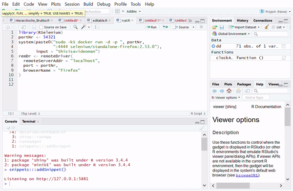
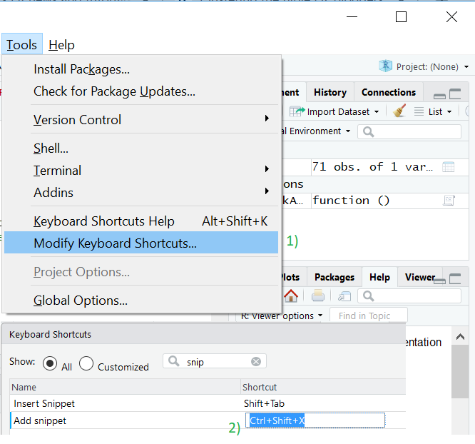

# RStudio snippets programmatically

The `package:snippets` enables you to (add/remove/read) snippets programmatically.

(Usual way so far is to access RStudio snippets via: RStudio - Tools - Global Options - Code - Edit Snippets...)

**Usage:**




Via code:
```
addSnippet("test", "print('This is long code i dont want to retype everytime')")
```

```
readSnippet("test")
snippet test
    print('This is long code i dont want to retype everytime')
```

```
removeSnippet("test")
```

**Combining  with keyboard shortcuts:**


**Open issues:**

Snippets seem only to be updated if `r.snippets` file will opened afterwards (in RStudio). As a workaround i call
`file.edit("~/.R/snippets/r.snippets")` at the end of the functions.
